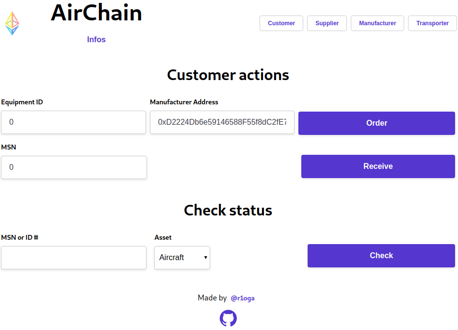
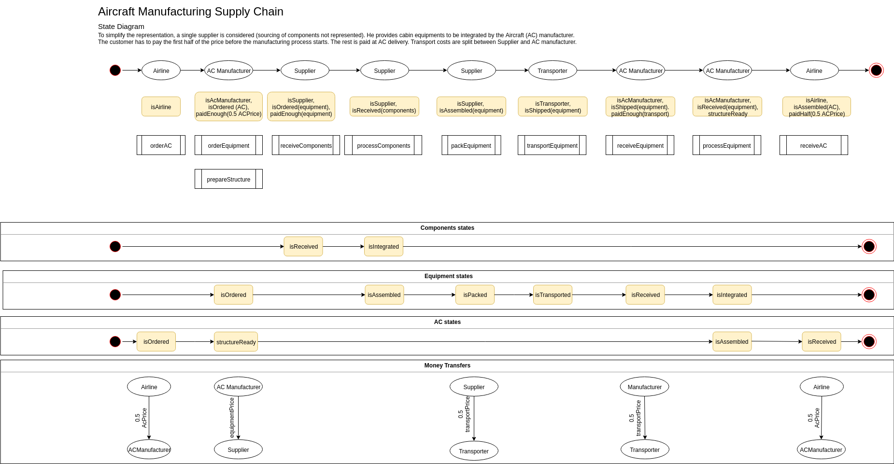
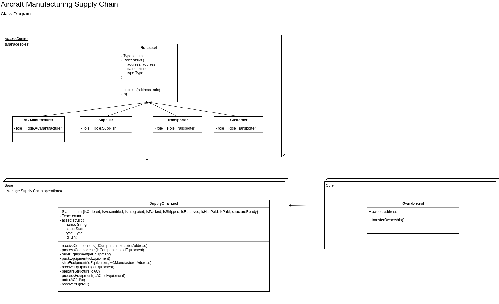

# [AirChain](https://r1oga.github.io/airChain)

Ethereum DApp to manage a Supply Chain flow between a Customer, a Manufacturer, a Supplier and a Transporter during the manufacturing of an aircraft.

## Worfklow and User Stories

1. User  
Orders an Aircraft (AC). Pays half of the AC price upfront.  
*Inputs: Equipment ID, Manufacturer address.*
2. AC manufacturer  
    - Orders the equipment from the supplier. Pays equipment price.  
    *Inputs: Equipment ID, Supplier ID, Manufacturer Serial Number (MSN).*
    - Prepares the AC structure  
    *Inputs: Origin Plant, Aircraft notes.*
3. Supplier  
Receives component for the ordered equipment.  
*Inputs: Component ID, Equipment ID, Component manufacturer name (optional),
Component's origin (optional).*
4. Supplier  
Processes equipment. Only the same supplier as the one who was contracted by the manufacturer (who ordered the given equipment) can process a received component on it. Indicates notes and the equipment's origin.  
*Inputs: Component ID, Equipment Origin (optional), Equipment notes (optional).*

5. Supplier  
Packs equipment. Pays the first half of the transport fee.  
*Inputs: Equipment ID, Transporter address.*
6. Transporter  
Transports equipment.  
*Input: Equipment ID.*
7. Manufacturer:  
Receives equipment. Pays the second half of the transport fee.  
*Input: Equipment ID.*
8. Manufacturer  
Processes equipment.  
*Inputs: Equipment ID, Equipment notes (optional).*
9. Customer  
Receives the ordered AC. Pays the second half of the AC price.  
*Input: MSN.*

For further views of the workflow described above, consider looking at the other [UML diagrams](./UML):
- [Activity diagram](./UML/AC_SupplyChain_ActivityDiagram.png)
- [Sequence diagram](./images/UML/AC_SupplyChain_SequenceDiagram.png)

## Architecture

## Contract details
This contract is deployed on the Rinkeby network!  
So the ETH available on these test accounts aren't worth anything :-p. The private keys are only listed so that one can load them in one's Metamask wallet and play around with the DApp.
- [**Contract address**](https://rinkeby.etherscan.io/address/0xbac7c73d28545fd816fa3b8448213225e9a7de09): 0xBaC7C73D28545fd816Fa3b8448213225e9a7De09
- **Contract owner** (deployed from address): 0x45517697E4fc823BE60a066EcCa8139Ce9C4659e
- **Test users created**  
  - *Test_customer*
    - address: 0x05a9FD6814B19D43403A0eB2039d3A5A64797684
    - private key: 28B5483F414EAC91967F041BB283CB887371A316EA6437C8D02AC6338DE27642
    - add role [transaction](https://rinkeby.etherscan.io/tx/0x9e2e4736bbe22f8e2e2e3531b3c0729d6cd943b4df1247a3d9db55592c5bd679)
  - *Test_manufacturer*
    - address: 0xD2224Db6e59146588F55f8dC2fE7C95649250E01
    - private key: DDE34AADD343A00BE2B201A42FFC5AC9005C01F7AA82A64604934658C35EAF33
    - add role [transaction](https://rinkeby.etherscan.io/tx/0x633f559c67b604a43a0d12b6f47446126158e9699ee6f9d03c821fd2767d6655)
  - *Test_supplier*
    - address: 0xAe269f47Aa55D0bD1888A9D347f6e7107141A9Bd
    - private key: CC8634E2C694F4AAD0E263E62E6282FEFD0CEDB482686610F7F2D4365538B5A2
    - add role [transaction](https://rinkeby.etherscan.io/tx/0x8836f9e8454b252a624f4525061304bfb20a31b2852d7ec8641e69e3f30740b0)
  - *Test_transporter*
    - address: 0x7833f7d5A9191c98A4b6c2bA957eA77d9DD6AeCa
    - private key: A38F9C1331B522B469B77A5A8A913FF0173771A10B938F527E29BA187E9768C6
    - add role [transaction](https://rinkeby.etherscan.io/tx/0x6833c17906d074fbffbc098d2eceb20214692cb2475028e638f5b715f495de4e)
- **Test transactions**
  - [orderAircraft](https://rinkeby.etherscan.io/tx/0x39687ce22948cb4ac43d2d6e44c3eff2ba5593091deb9958133d87c14d2e3d4c) by Test_customer
  - [withdraw payment](https://rinkeby.etherscan.io/tx/0xdc15c6fd0762caeb769cb56cb32663c62ea11c9eccafcde4ca2490dc1dad95dc) by Test_manufacturer

## Resources
- [Truffle v5.0.1](https://www.truffleframework.com/): smart contracts and DAPP development framework.
- [Node v11.4.0](https://nodejs.org/en/): JavaScript runtime environment.
- [npm 6.4.1](https://www.npmjs.com/get-npm)
  - [web3 1.0.0-beta.46](https://www.npmjs.com/package/web3): Ethereum JavaScript API
  - [truffle-assertions](https://www.npmjs.com/package/truffle-assertions): test especially event emissions inside Truffle tests. [Tutorial](https://kalis.me/check-events-solidity-smart-contract-test-truffle/)
- [Infura](https://infura.io/): API to access remote Ethereum nodes
- [Metamask](https://metamask.io/): browser add-in to interact with the JavaScript Ethereum API [Web3](https://github.com/ethereum/web3.js/).
- [Solidity](https://github.com/ethereum/solidity): language for implementing smart contrats.
- [Withdrawal pattern](https://solidity.readthedocs.io/en/v0.4.24/common-patterns.html#withdrawal-from-contracts) for smart contracts
- [Rimble UI](https://rimble.consensys.design/)
- [create eth app](https://github.com/PaulRBerg/create-eth-app)
